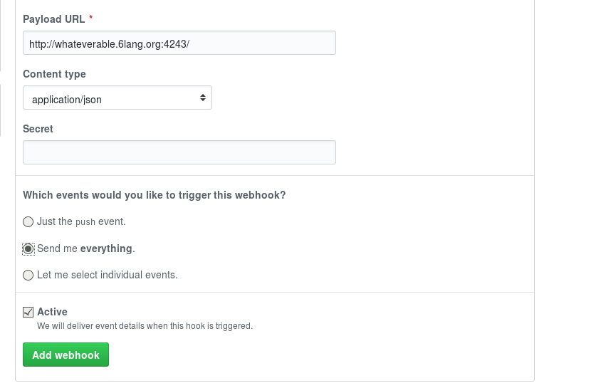

# Hactkoberfest Squashaton

The Perl 6 community celebrates a [monthly bug squash (long)
day](https://github.com/rakudo/rakudo/wiki/Monthly-Bug-Squash-Day),
and we make the one in Octobre coincide
with [the Hacktoberfest](https://hacktoberfest.digitalocean.com/).

We want all the community to benefit from this, so we have created a
procedure that makes (relatively) easy to participate in the
Squashathon, at the same time your pull-requesters participate in
Hacktoberfest. The main objective of this is to be aware of the
modules people have offered, so that the bots take care of them and
publish modifications in the Perl 6 IRC channels.

## Create a `hacktoberfest` issue label and add it to some issues.

This will help your project show up in search results such
as
[this one](https://github.com/search?q=label%3Ahacktoberfest+language%3Aperl6). People
explicitly wanting to work on Perl 6 code will use them, whether they
are participating in the hackathon or not.

Bear in mind that these will be casual users. Elaborate, heavily
cross-referenced, issues, are probably your best bet. They might be
newcomers not only to your project, but also your language and even
your programming paradigm. Also, you'll be representing the whole Perl
6 community here. Be super-extra-kind to them answering their
questions and pointing them to additional resources without resorting
to RTFM.

## Add your project to the Squashathon

You will need to add a GitHub hook to your repository.

> If you host your module at GitLab or somewhere else, you can do this
> too. You can skip the part where you tag stuff with Hacktoberfest,
> since it's limited to GitHub.

1. Go to Settings → Webhooks → Add webhook in your GitHub
   repository. Enter password if it's needed.
2. Use http://whateverable.6lang.org:4243/ as Payload URL, set
   `Content-type` to `application/json`, and mark on *Send me
   **everything*** like this, adding secret `squashathon`. Click on *Add webhook* to make it work.
   

## Hang around in the #perl6 IRC channel

This webhook will be active during the Squashathon, roughly 11 AM
Friday Oct 5th - 11 AM Sunday Oct 7th. During that time, every code or
repo change will be broadcast
to
[the #perl6 IRC channel](https://webchat.freenode.net/?channels=#perl6). Hang
around as much (or little) as you want, ask/answer questions, help
others or ask for help. 
